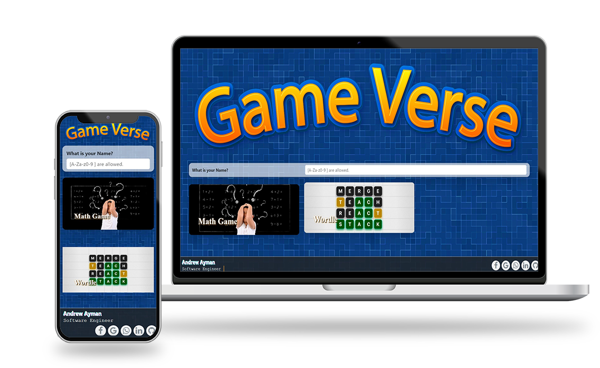
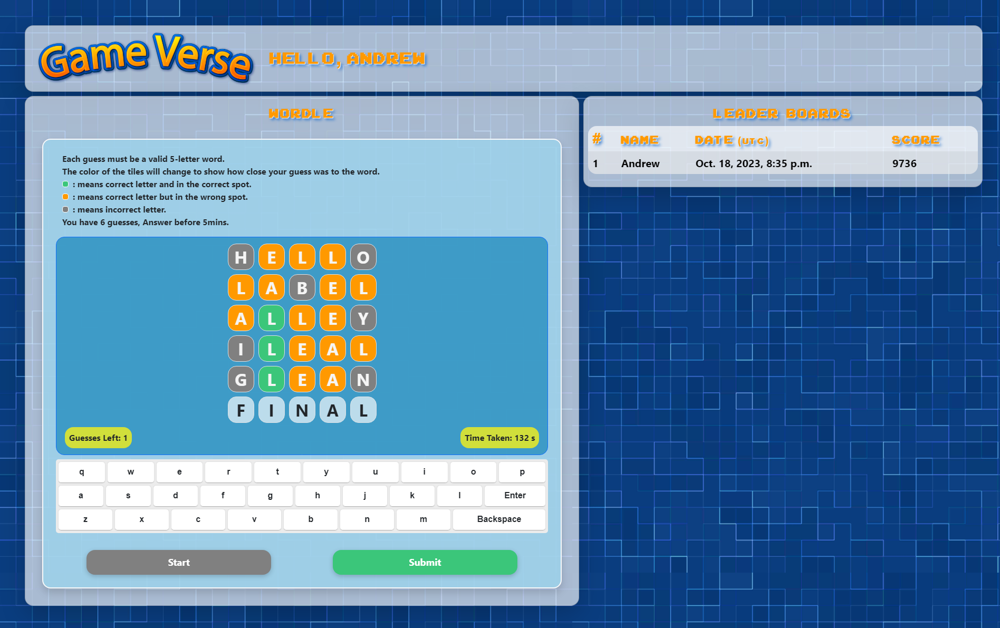

<div align="center">

  <h1> <a href="https://game-verse.onrender.com/"> Game Verse </a></h1>
  
  
  
  
  
  
  
  
  
  <h3>  Unleash the Power of Your Game with Real-Time Security!</h3>
  
  


</div>

## :star2: About The Project



Elevate your gaming experience with a secure and scalable website built on Render! This platform boasts impressive features to keep your game running smoothly:

-   **Blazing-Fast Performance**: Render's cloud infrastructure ensures up to 10x faster load times compared to traditional hosting solutions.
-   **Fort Knox Security**: Protect your scores and leaderboards with the power of WebSockets. All calculations are performed on the server-side, keeping sensitive data out of reach.
-   **Effortless Scalability**: Render seamlessly adapts to your needs. Whether you have 10 or 10,000 players, your website will handle the traffic with ease.
-   **Built with the Best**: This website is crafted using the robust Django framework for backend development and Bootstrap for a user-friendly, responsive design.

Don't settle for lag and insecurity. Take your game to the next level with a **Render-powered** website!


## :toolbox: Installation

1. Clone the repo
    ```sh
    git clone https://github.com/Andrew-Ayman123/Django-Game-Verse.git
    ```
2. Install Python packages
    ```sh
    pip install -r requirements.txt
    ```
3. Run server on localhost(port 8000)
    ```sh
    python manage.py runserver
    ```

[Bootstrap]: https://img.shields.io/badge/Bootstrap-563D7C?style=for-the-badge&logo=bootstrap&logoColor=white
[Python]: https://img.shields.io/badge/Python-3776AB?style=for-the-badge&logo=python&logoColor=white
[HTML]: https://img.shields.io/badge/HTML5-E34F26?style=for-the-badge&logo=html5&logoColor=white
[CSS]: https://img.shields.io/badge/CSS3-1572B6?style=for-the-badge&logo=css3&logoColor=white
[JS]: https://img.shields.io/badge/JavaScript-323330?style=for-the-badge&logo=javascript&logoColor=F7DF1E
[Django]: https://img.shields.io/badge/Django-092E20?style=for-the-badge&logo=django&logoColor=white
[Sqllite]: https://img.shields.io/badge/SQLite-07405E?style=for-the-badge&logo=sqlite&logoColor=white
